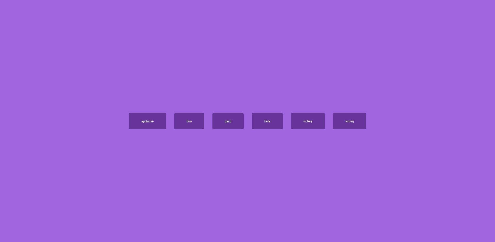

<div align="center">
  
  <h1>Anderson Toledo Martins Moreira</h1>
  <h4> Frontend Software Developer <br />
    <a href="http://www.atmm.dev" target="_blank">Resume Online</a>
  </h4>
</div>

<!-- References for Create budgets :: https://shields.io/category/build -->
<div align="center">
    
</div>

## Description
This project is to trainning javascript and CSS. <br />
It is a simple project to Create a Sound Board.

## Screens Layout
<div align="center">
  
</div>

## Programming Languages and Frameworks.
```bash
# Javascript
# CSS
# Vite
# Node
# Git / Github
```

## System Requirements
```bash
# Git
# Node
```

## Getting Started With Local Development Configuration
```bash
# Download or clone the repository.
# Open the project inside your favorite IDE (I use VSCode).
# In your terminal, type: `npm install`, to install vite and dependencies.
# After finish this process, type `npm run dev`, to start the project.
# In you terminal you will see the localhost address, for example `http://localhost:5173/`.
# So, to see the project, open this address in your browser.
```